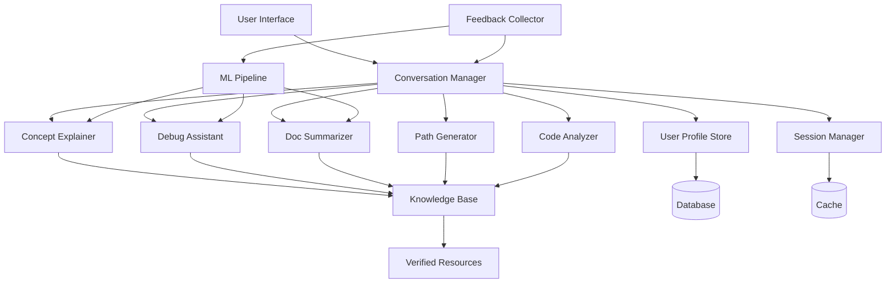

# Design Document: AI-Powered Learning Platform

## Overview

The AI-powered learning and developer productivity platform is designed as a conversational system that provides personalized learning assistance, debugging guidance, documentation summarization, and code quality analysis. The platform uses natural language processing and code understanding models to deliver contextual, adaptive support to learners and beginner developers.

The system architecture follows a modular design with specialized components for different capabilities (concept explanation, debugging, summarization, etc.), unified through a conversation manager that maintains context and routes requests appropriately. All AI responses are grounded in a verified knowledge base to ensure accuracy and prevent hallucinations.

## Architecture

### High-Level Architecture



### Component Responsibilities

**Conversation Manager**: 
- Routes user requests to appropriate specialized components
- Maintains session context and conversation history
- Orchestrates multi-step interactions
- Aggregates responses from multiple components when needed

**Concept Explainer**:
- Generates step-by-step explanations of programming concepts
- Adapts complexity based on user skill level
- Provides code examples and analogies
- Grounds explanations in verified educational resources

**Debug Assistant**:
- Analyzes error messages and stack traces
- Examines code context to identify root causes
- Generates step-by-step debugging guidance
- Ranks potential solutions by likelihood

**Doc Summarizer**:
- Extracts key information from documentation
- Identifies essential APIs, parameters, and usage patterns
- Preserves technical accuracy while condensing content
- Maintains references to original sources

**Path Generator**:
- Creates personalized learning roadmaps
- Sequences topics from foundational to advanced
- Adapts paths based on user progress
- Recommends specific resources and milestones

**Code Analyzer**:
- Evaluates code quality across multiple dimensions
- Identifies best-practice violations
- Suggests improvements with explanations
- Prioritizes suggestions by impact

**User Profile Store**:
- Maintains user skill levels and learning goals
- Tracks progress on learning paths
- Stores interaction history for personalization
- Provides privacy controls and data deletion

**Knowledge Base**:
- Stores verified learning resources and documentation
- Provides retrieval mechanisms for grounding AI responses
- Supports updates and versioning of resources
- Enables source citation

**Session Manager**:
- Maintains conversation context within sessions
- Implements context window management
- Caches frequently accessed information
- Handles session expiration and cleanup

**Feedback Collector**:
- Captures user ratings and feedback
- Logs interactions for quality analysis
- Feeds data to ML pipeline for improvements
- Tracks outcome metrics

## Components and Interfaces

### Conversation Manager Interface

```typescript
interface ConversationManager {
  // Process user message and route to appropriate components
  processMessage(userId: string, sessionId: string, message: string): Promise<Response>
  
  // Get conversation history for context
  getSessionContext(sessionId: string): Promise<ConversationContext>
  
  // Create new session for user
  createSession(userId: string): Promise<string>
  
  // End session and cleanup
  endSession(sessionId: string): Promise<void>
}

interface ConversationContext {
  sessionId: string
  userId: string
  messageHistory: Message[]
  currentTopic: string | null
  userIntent: Intent
}

interface Message {
  role: 'user' | 'assistant'
  content: string
  timestamp: Date
  componentUsed?: string
}

enum Intent {
  EXPLAIN_CONCEPT,
  DEBUG_ERROR,
  SUMMARIZE_DOCS,
  GENERATE_PATH,
  ANALYZE_CODE,
  GENERAL_QUERY
}
```

### Concept Explainer Interface

```typescript
interface ConceptExplainer {
  // Generate explanation for a programming concept
  explainConcept(
    concept: string,
    userLevel: SkillLevel,
    context: string[]
  ): Promise<Explanation>
  
  // Provide follow-up clarification
  clarify(
    originalExplanation: Explanation,
    clarificationRequest: string
  ): Promise<Explanation>
}

interface Explanation {
  concept: string
  summary: string
  stepByStepBreakdown: Step[]
  codeExamples: CodeExample[]
  analogies: string[]
  sources: Source[]
  relatedConcepts: string[]
}

interface Step {
  order: number
  title: string
  description: string
  visualAid?: string
}

interface CodeExample {
  language: string
  code: string
  explanation: string
  runnable: boolean
}

enum SkillLevel {
  BEGINNER,
  INTERMEDIATE,
  ADVANCED
}
```

### Debug Assistant Interface

```typescript
interface DebugAssistant {
  // Analyze error and provide debugging guidance
  analyzeError(
    errorMessage: string,
    stackTrace?: string,
    codeContext?: CodeContext
  ): Promise<DebugGuidance>
  
  // Suggest solutions for identified issue
  suggestSolutions(issue: Issue): Promise<Solution[]>
}

interface DebugGuidance {
  errorType: string
  rootCause: string
  explanation: string
  debuggingSteps: DebugStep[]
  solutions: Solution[]
  preventionTips: string[]
}

interface DebugStep {
  order: number
  action: string
  expectedOutcome: string
  troubleshooting: string
}

interface Solution {
  description: string
  codeChange?: CodeChange
  likelihood: number // 0-1 probability of fixing issue
  tradeoffs: string[]
}

interface CodeContext {
  language: string
  code: string
  lineNumber?: number
  fileName?: string
}

interface CodeChange {
  before: string
  after: string
  explanation: string
}
```

### Doc Summarizer Interface

```typescript
interface DocSummarizer {
  // Summarize documentation text or URL
  summarize(
    input: DocumentationInput,
    focusAreas?: string[]
  ): Promise<Summary>
  
  // Extract API information specifically
  extractAPI(documentation: string): Promise<APIReference>
}

interface DocumentationInput {
  type: 'text' | 'url'
  content: string
  language?: string
}

interface Summary {
  overview: string
  keyPoints: KeyPoint[]
  apiHighlights?: APIHighlight[]
  usageExamples: CodeExample[]
  sources: Source[]
}

interface KeyPoint {
  topic: string
  description: string
  importance: 'high' | 'medium' | 'low'
}

interface APIHighlight {
  name: string
  type: 'class' | 'function' | 'method' | 'constant'
  signature: string
  description: string
  parameters: Parameter[]
  returnValue?: ReturnValue
}

interface Parameter {
  name: string
  type: string
  description: string
  required: boolean
  defaultValue?: string
}

interface ReturnValue {
  type: string
  description: string
}
```

### Path Generator Interface

```typescript
interface PathGenerator {
  // Generate personalized learning path
  generatePath(
    userId: string,
    goals: LearningGoal[],
    currentLevel: SkillLevel
  ): Promise<LearningPath>
  
  // Update path based on progress
  updatePath(
    pathId: string,
    progress: Progress
  ): Promise<LearningPath>
}

interface LearningGoal {
  description: string
  targetSkill: string
  timeframe?: string
  priority: number
}

interface LearningPath {
  pathId: string
  userId: string
  goals: LearningGoal[]
  milestones: Milestone[]
  currentMilestone: number
  estimatedCompletion: Date
}

interface Milestone {
  order: number
  title: string
  description: string
  topics: Topic[]
  resources: Resource[]
  assessments: Assessment[]
  completed: boolean
}

interface Topic {
  name: string
  description: string
  prerequisites: string[]
  estimatedHours: number
}

interface Resource {
  type: 'article' | 'video' | 'tutorial' | 'exercise'
  title: string
  url: string
  duration?: number
  difficulty: SkillLevel
}

interface Assessment {
  type: 'quiz' | 'project' | 'exercise'
  description: string
  passingCriteria: string
}

interface Progress {
  completedTopics: string[]
  assessmentResults: AssessmentResult[]
  timeSpent: number
}

interface AssessmentResult {
  assessmentId: string
  passed: boolean
  score?: number
  feedback: string
}
```

### Code Analyzer Interface

```typescript
interface CodeAnalyzer {
  // Analyze code quality and suggest improvements
  analyzeCode(
    code: string,
    language: string,
    context?: AnalysisContext
  ): Promise<CodeAnalysis>
  
  // Explain specific suggestion in detail
  explainSuggestion(suggestionId: string): Promise<SuggestionExplanation>
}

interface AnalysisContext {
  fileName?: string
  projectType?: string
  targetAudience?: 'production' | 'learning' | 'prototype'
}

interface CodeAnalysis {
  overallScore: number // 0-100
  dimensions: QualityDimension[]
  suggestions: Suggestion[]
  strengths: string[]
  summary: string
}

interface QualityDimension {
  name: 'readability' | 'efficiency' | 'maintainability' | 'security' | 'best-practices'
  score: number // 0-100
  issues: Issue[]
}

interface Suggestion {
  id: string
  priority: 'high' | 'medium' | 'low'
  category: string
  description: string
  codeLocation: CodeLocation
  suggestedChange: CodeChange
  rationale: string
  impact: string
}

interface CodeLocation {
  startLine: number
  endLine: number
  startColumn?: number
  endColumn?: number
}

interface Issue {
  description: string
  severity: 'error' | 'warning' | 'info'
  location: CodeLocation
}

interface SuggestionExplanation {
  suggestionId: string
  detailedRationale: string
  examples: CodeExample[]
  references: Source[]
}
```

### User Profile Store Interface

```typescript
interface UserProfileStore {
  // Create new user profile
  createProfile(userId: string, initialData: ProfileData): Promise<UserProfile>
  
  // Get user profile
  getProfile(userId: string): Promise<UserProfile>
  
  // Update user profile
  updateProfile(userId: string, updates: Partial<ProfileData>): Promise<UserProfile>
  
  // Delete user profile and data
  deleteProfile(userId: string): Promise<void>
  
  // Track user progress
  recordProgress(userId: string, progress: Progress): Promise<void>
}

interface UserProfile {
  userId: string
  skillLevel: SkillLevel
  learningGoals: LearningGoal[]
  activePaths: string[]
  completedMilestones: string[]
  preferences: UserPreferences
  interactionHistory: InteractionSummary[]
  createdAt: Date
  updatedAt: Date
}

interface ProfileData {
  skillLevel: SkillLevel
  learningGoals: LearningGoal[]
  preferences: UserPreferences
}

interface UserPreferences {
  explanationStyle: 'concise' | 'detailed' | 'visual'
  codeExamplePreference: string[] // preferred languages
  notificationSettings: NotificationSettings
}

interface NotificationSettings {
  milestoneReminders: boolean
  dailyTips: boolean
  progressReports: boolean
}

interface InteractionSummary {
  date: Date
  interactionType: Intent
  topicsDiscussed: string[]
  satisfactionRating?: number
}
```

### Knowledge Base Interface

```typescript
interface KnowledgeBase {
  // Query knowledge base for relevant information
  query(
    query: string,
    context: QueryContext
  ): Promise<KnowledgeResult[]>
  
  // Add new verified resource
  addResource(resource: VerifiedResource): Promise<string>
  
  // Update existing resource
  updateResource(resourceId: string, updates: Partial<VerifiedResource>): Promise<void>
  
  // Get source citation
  getCitation(resourceId: string): Promise<Source>
}

interface QueryContext {
  intent: Intent
  userLevel: SkillLevel
  maxResults: number
}

interface KnowledgeResult {
  resourceId: string
  content: string
  relevanceScore: number
  source: Source
  metadata: ResourceMetadata
}

interface VerifiedResource {
  resourceId?: string
  title: string
  content: string
  type: 'concept' | 'tutorial' | 'documentation' | 'best-practice'
  topics: string[]
  difficulty: SkillLevel
  source: Source
  verifiedBy: string
  verifiedAt: Date
}

interface Source {
  title: string
  author?: string
  url?: string
  publicationDate?: Date
  license?: string
}

interface ResourceMetadata {
  topics: string[]
  difficulty: SkillLevel
  lastUpdated: Date
  popularity: number
}
```

## Data Models

### Core Data Structures

**Session**:
```typescript
interface Session {
  sessionId: string
  userId: string
  startTime: Date
  lastActivity: Date
  messageCount: number
  context: ConversationContext
  active: boolean
}
```

**Response**:
```typescript
interface Response {
  content: string
  type: 'explanation' | 'debug' | 'summary' | 'path' | 'analysis' | 'general'
  components: ComponentResponse[]
  suggestions: string[]
  sources: Source[]
  feedbackPrompt: string
}

interface ComponentResponse {
  component: string
  data: any
  confidence: number
}
```

### Database Schema

**Users Table**:
- userId (PK)
- skillLevel
- createdAt
- updatedAt
- preferences (JSON)

**LearningPaths Table**:
- pathId (PK)
- userId (FK)
- goals (JSON)
- milestones (JSON)
- currentMilestone
- createdAt
- updatedAt

**Progress Table**:
- progressId (PK)
- userId (FK)
- pathId (FK)
- completedTopics (JSON)
- assessmentResults (JSON)
- timeSpent
- recordedAt

**Interactions Table**:
- interactionId (PK)
- userId (FK)
- sessionId (FK)
- intent
- query
- response
- componentUsed
- satisfactionRating
- timestamp

**KnowledgeResources Table**:
- resourceId (PK)
- title
- content (TEXT)
- type
- topics (JSON)
- difficulty
- source (JSON)
- verifiedBy
- verifiedAt
- popularity

**Feedback Table**:
- feedbackId (PK)
- interactionId (FK)
- rating
- comment
- feedbackType
- timestamp

## Correctness Properties

*A property is a characteristic or behavior that should hold true across all valid executions of a system—essentially, a formal statement about what the system should do. Properties serve as the bridge between human-readable specifications and machine-verifiable correctness guarantees.*

